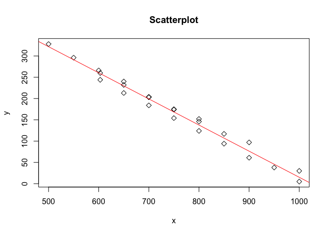

Homework\_5
================
Karla Palos

CHAPTER 11
----------

39\*
----

An experiment was done to test a method for reducing faults on telephone lines (Welch 1987). Fourteen matched pairs of areas were used. The following table shows the fault rates for the control areas and for the test areas:

``` r
test <-c(676,206,230,256,280,433,337,466,497,512,794,428,452,512)
control <-c(88,570,605,617,653,2913,924,286,1098,982,2346,321,615,519)


differences =test-control
```

1.  Plot the differences versus the control rate and summarize what you see.

``` r
plotdiff <- qqplot(control, differences)
```


``` r
plotdiff
```

    ## $x
    ##  [1]   88  286  321  519  570  605  615  617  653  924  982 1098 2346 2913
    ## 
    ## $y
    ##  [1] -2480 -1552  -601  -587  -470  -375  -373  -364  -361  -163    -7
    ## [12]   107   180   588

1.  Calculate the mean difference,its standard deviation,and a confidence interval.

``` r
#mean
differences_mean <- mean(differences)

#var
VarDiff <-var(differences)

#SD
SDDiff <- sqrt(VarDiff/14)

#CI
#Difference +- t(n-1),(1-aplha)SD Difference

test<- t.test(differences, alterative="two.sided", conf.level=.95)
test
```

    ## 
    ##  One Sample t-test
    ## 
    ## data:  differences
    ## t = -2.2776, df = 13, p-value = 0.0403
    ## alternative hypothesis: true mean is not equal to 0
    ## 95 percent confidence interval:
    ##  -898.83174  -23.73969
    ## sample estimates:
    ## mean of x 
    ## -461.2857

``` r
#from the t-test we can see that the 95% CI is (-898.83,-23.75)
CI_lowerbound <- -898.83
CI_upperbound <- -23.75


#values DF
values <-c(differences_mean, VarDiff, SDDiff, CI_lowerbound, CI_upperbound)
names<-c("differences_mean", "Var Difference", "SD Difference", "95% CI lower bound","95% CI upper bound" )
name_value<- data.frame(names, values)
name_value
```

    ##                names      values
    ## 1   differences_mean   -461.2857
    ## 2     Var Difference 574274.8352
    ## 3      SD Difference    202.5330
    ## 4 95% CI lower bound   -898.8300
    ## 5 95% CI upper bound    -23.7500

1.  Calculate the median difference and a confidence interval and compare to the previous result.

``` r
library(dplyr)
```

    ## 
    ## Attaching package: 'dplyr'

    ## The following objects are masked from 'package:stats':
    ## 
    ##     filter, lag

    ## The following objects are masked from 'package:base':
    ## 
    ##     intersect, setdiff, setequal, union

``` r
#median difference
sorted_differences<- sort(differences)
median_diff <-median(sorted_differences)
median_diff
```

    ## [1] -368.5

``` r
#finding CI
#1) bootstrap
pop <- differences
num_samples <- 1000
sample_size <- 14
my_sample <- sample(pop,sample_size)

find_median <- function(){
  resample <- my_sample%>%sample(replace=TRUE)
  sort_resample <- sort(resample)
  median(sort_resample)
}

median_differences_vector <-  replicate(num_samples,find_median())

mean(median_differences_vector)
```

    ## [1] -347.089

``` r
sd(median_differences_vector)
```

    ## [1] 118.0079

``` r
sigma_hat<- sqrt( var(my_sample)/14)

quantile(median_differences_vector,.025)
```

    ##   2.5% 
    ## -535.5

``` r
quantile(median_differences_vector,.975)
```

    ## 97.5% 
    ##    -7

1.  Do you think it is more appropriate to use a t test or a non parametric method to test whether the apparent difference between test and control could be due to chance? Why? Carry out both tests and compare.

``` r
#T-test
#used above 
test<- t.test(differences, alterative="two.sided", conf.level=.95)
test
```

    ## 
    ##  One Sample t-test
    ## 
    ## data:  differences
    ## t = -2.2776, df = 13, p-value = 0.0403
    ## alternative hypothesis: true mean is not equal to 0
    ## 95 percent confidence interval:
    ##  -898.83174  -23.73969
    ## sample estimates:
    ## mean of x 
    ## -461.2857

``` r
#non Parametic
test <-c(676,206,230,256,280,433,337,466,497,512,794,428,452,512)
control <-c(88,570,605,617,653,2913,924,286,1098,982,2346,321,615,519)


differences =test-control
abs_differences <-abs(differences)
rank <- rank(abs_differences)
signed_rank <- rank*(differences/abs_differences)

data_f<- data.frame(test,control,differences, abs_differences,rank, signed_rank)

qqnorm(differences)
qqline(differences)
```


``` r
W_pos <- data_f%>%filter(data_f[,6]>0)
W_pos
```

    ##   test control differences abs_differences rank signed_rank
    ## 1  676      88         588             588   11          11
    ## 2  466     286         180             180    4           4
    ## 3  428     321         107             107    2           2

``` r
wilcox.test(differences, alternative = "two.sided", conf.level = .95)
```

    ## 
    ##  Wilcoxon signed rank test
    ## 
    ## data:  differences
    ## V = 17, p-value = 0.02454
    ## alternative hypothesis: true location is not equal to 0

48\*
----

Proteinuria,the presence of excess protein in urine,is a symptom of renal(kidney) distress among diabetics. Taguma et al. (1985) studied the effects of captopril for treating proteinuria in diabetics. Urinary protein was measured for 12 patients before and after eight weeks of captopril therapy. The amounts of urinary protein (in g/24 hrs) before and after therapy are shown in the following table. What can you conclude about the effect of captopril? Consider using parametric or nonparametric methods and analyzing the data on the original scale or on a log scale.

``` r
before <- c(24.6, 17, 16, 10.4, 8.2, 7.9, 8.2, 7.9, 5.8, 5.4, 5.1, 4.7)
after <- c(10.1, 5.7, 5.6, 3.4, 6.5, 0.7, 6.5, 0.7, 6.1, 4.7, 2.0, 2.9 )

#H0: mu_Difference =0; that is distributiion is symmetric about 0 

#H1: mu_Difference =!0; distrobution is not symmetric about 0

diff<- before-after

#Parametric
t.test(before, after, paired= TRUE)
```

    ## 
    ##  Paired t-test
    ## 
    ## data:  before and after
    ## t = 4.0012, df = 11, p-value = 0.002082
    ## alternative hypothesis: true difference in means is not equal to 0
    ## 95 percent confidence interval:
    ##  2.485818 8.564182
    ## sample estimates:
    ## mean of the differences 
    ##                   5.525

``` r
#Non Parametric
abs_diff=abs(diff)
rank <- rank(abs_diff)
signed_rank <- rank*(diff/abs_diff)
df <- data.frame(before,after,diff, abs_diff,rank, signed_rank)
df
```

    ##    before after diff abs_diff rank signed_rank
    ## 1    24.6  10.1 14.5     14.5 12.0        12.0
    ## 2    17.0   5.7 11.3     11.3 11.0        11.0
    ## 3    16.0   5.6 10.4     10.4 10.0        10.0
    ## 4    10.4   3.4  7.0      7.0  7.0         7.0
    ## 5     8.2   6.5  1.7      1.7  3.5         3.5
    ## 6     7.9   0.7  7.2      7.2  8.5         8.5
    ## 7     8.2   6.5  1.7      1.7  3.5         3.5
    ## 8     7.9   0.7  7.2      7.2  8.5         8.5
    ## 9     5.8   6.1 -0.3      0.3  1.0        -1.0
    ## 10    5.4   4.7  0.7      0.7  2.0         2.0
    ## 11    5.1   2.0  3.1      3.1  6.0         6.0
    ## 12    4.7   2.9  1.8      1.8  5.0         5.0

``` r
qqnorm(diff)
qqline(diff)
```


``` r
wplus<- df%>%filter(df[,6]>0)
wplus
```

    ##    before after diff abs_diff rank signed_rank
    ## 1    24.6  10.1 14.5     14.5 12.0        12.0
    ## 2    17.0   5.7 11.3     11.3 11.0        11.0
    ## 3    16.0   5.6 10.4     10.4 10.0        10.0
    ## 4    10.4   3.4  7.0      7.0  7.0         7.0
    ## 5     8.2   6.5  1.7      1.7  3.5         3.5
    ## 6     7.9   0.7  7.2      7.2  8.5         8.5
    ## 7     8.2   6.5  1.7      1.7  3.5         3.5
    ## 8     7.9   0.7  7.2      7.2  8.5         8.5
    ## 9     5.4   4.7  0.7      0.7  2.0         2.0
    ## 10    5.1   2.0  3.1      3.1  6.0         6.0
    ## 11    4.7   2.9  1.8      1.8  5.0         5.0

``` r
wilcox.test(before,after,paired = TRUE)
```

    ## Warning in wilcox.test.default(before, after, paired = TRUE): cannot
    ## compute exact p-value with ties

    ## 
    ##  Wilcoxon signed rank test with continuity correction
    ## 
    ## data:  before and after
    ## V = 77, p-value = 0.00324
    ## alternative hypothesis: true location shift is not equal to 0

50
--

The file bodytemp contains normal body temperature readings (degrees Fahrenheit) and heart rates (beats per minute) of 65 males (coded by 1) and 65 females (coded by 2) from Shoemaker (1996). a. Using normal theory, form a 95% confidence interval for the difference of mean body temperatures between males and females. Is the use of the normal approximation reasonable?

1.  Using normal theory, form a 95% confidence interval for the difference of mean heart rates between males and females. Is the use of the normal approx- imation reasonable?

2.  Use both parametric and nonparametric tests to compare the body tempera- tures and heart rates. What do you conclude?

2, 5*, 6, 12*, 18*,23, 29*, 38\*

CHAPTER 14
----------

2
-

Plot y versus x for the following pairs:

``` r
x<- c(.34,1.38, -.65, .68, 1.40, -0.88, -.30, -1.18,.50, -1.75)
y <- c(.27, 1.34, -.53, .35, 1.28,-.98,-.72,-.81, .64 ,-1.59)
```

1.  Fit a line y = a + bx by the method of least squares, and sketch it on the plot.
2.  Fit a line x = c + dy by the method of least squares, and sketch
3.  Are the lines in parts (a) and (b) the same? If not, why not?

38\* The file sapphire lists observed values of Young’s modulus (g) measured at various temperatures (T ) for sapphire rods (Ku 1969). Fit a linear relationship g = β0 +β1t, and form confidence intervals for the coefficients. Examine the residuals.
--------------------------------------------------------------------------------------------------------------------------------------------------------------------------------------------------------------------------------------------------------

``` r
path <- file.path("~","Desktop","sapphire.csv")
sapphire <- read.csv(path)
x<- sapphire[,1]
y<- sapphire[,2]


regress <- lm(formula=y~x)
summary(regress)
```

    ## 
    ## Call:
    ## lm(formula = y ~ x)
    ## 
    ## Residuals:
    ##     Min      1Q  Median      3Q     Max 
    ## -16.731 -13.164   4.427   7.059  20.692 
    ## 
    ## Coefficients:
    ##              Estimate Std. Error t value Pr(>|t|)    
    ## (Intercept) 628.62878   13.42758   46.82   <2e-16 ***
    ## x            -0.61369    0.01761  -34.85   <2e-16 ***
    ## ---
    ## Signif. codes:  0 '***' 0.001 '**' 0.01 '*' 0.05 '.' 0.1 ' ' 1
    ## 
    ## Residual standard error: 11.72 on 22 degrees of freedom
    ## Multiple R-squared:  0.9822, Adjusted R-squared:  0.9814 
    ## F-statistic:  1214 on 1 and 22 DF,  p-value: < 2.2e-16

``` r
regress$coefficients
```

    ## (Intercept)           x 
    ## 628.6287753  -0.6136894

``` r
#g=regress$coefficients[1]+ t*regress$coefficients[2]
#g=628.6-0.614t


#CI:
#95% CI for Constat 
#from table we can see that the intercept is 628.6, and its standard error is 13.42758, in addition since we are computing a 95% CI, we find that the t value for (0.025) with 22 df is 2.074. Thefore the CI is [628.6- 2.074*13.42758, 628.6+2.074*13.42758]
CI <- c(628.6- 2.074*13.42758, 628.6+2.074*13.42758)

#95% CI for slope 
#form the table we can see that the slope is -0.61369 and its standard error is 0.01761, in addition since we are computing a 95% CI, we find that the t value for (0.025) with 22 df is 2.074. The CI is [-0.61369- 2.074*0.01761, -0.61369+2.074*0.01761]
CI <- c( -0.61369-2.074*0.01761, -0.61369+2.074*0.01761)


sapphires_residual  <-resid(regress)
resplot<- plot(x, sapphires_residual, ylab="Residuals", xlab="x", main = "Sapphires")
resplot + abline(0, 0)  
```


    ## integer(0)

``` r
fitted_plot <- plot(x, y, main="Scatterplot",  pch=5)
fitted_plot +abline(lm(y~x), col="red")
```



    ## integer(0)
