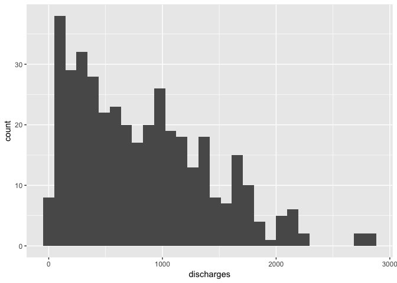
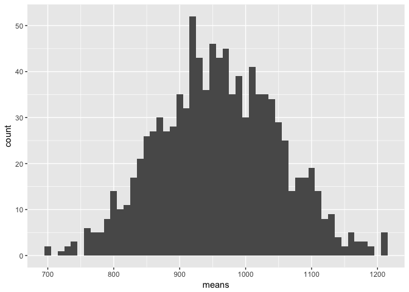

Lab\_2
================
Karla Palos

### Lab 1

``` r
library(readxl)
hospitals <- read_excel("../data/hospitals.xls")
cancer <- read_excel("../data/cancer.xls")
hospitalsM<- as.matrix(hospitals) # M = matrix
```

Problem a.

``` r
library(dplyr)
```

    ## 
    ## Attaching package: 'dplyr'

    ## The following objects are masked from 'package:stats':
    ## 
    ##     filter, lag

    ## The following objects are masked from 'package:base':
    ## 
    ##     intersect, setdiff, setequal, union

``` r
library(ggplot2)
new_data<- data.frame(hospitalsM)


ggplot(data=hospitals, aes(new_data$X.discharges.)) + geom_histogram() +xlab("discharges")
```

    ## `stat_bin()` using `bins = 30`. Pick better value with `binwidth`.



``` r
ggplot(data=hospitals, aes(new_data$X.beds.)) + geom_histogram() +xlab("beds")
```

    ## `stat_bin()` using `bins = 30`. Pick better value with `binwidth`.


Problem b.

``` r
colMeans(hospitalsM) #column means 
```

    ## 'discharges'       'beds' 
    ##     814.6031     274.8244

``` r
var(hospitalsM) # variance
```

    ##              'discharges'    'beds'
    ## 'discharges'     347766.4 114565.71
    ## 'beds'           114565.7  45484.23

``` r
sd(hospitalsM[,1]) #standard deviation
```

    ## [1] 589.7173

``` r
sd(hospitalsM[,2])
```

    ## [1] 213.2703

Problem c.

``` r
pop <- hospitalsM[,1] #pop =population
num_samples <- 1000
sample_size <- 25
my_sample <- sample(pop,sample_size);

#we will run this function many times
find_mean <- function(){
  resample <- my_sample %>% sample(replace=TRUE)
  mean(resample)
}

#create a vector of means
means <-  replicate(num_samples, find_mean())

#find SE of the sample mean
sd(means)
```

    ## [1] 90.96613

``` r
# histogram

my_data <- data.frame(means)

#make simple histogram
my_data %>% ggplot(aes(x=means)) + geom_histogram(binwidth=10)
```



Problem d.

``` r
# estimating mean from sample of size 25

my_sample <- sample(pop,sample_size);

mean(my_sample)
```

    ## [1] 905.08

Problem e.

``` r
# estimate of sigma^2

sigma_hat<- sqrt( var(my_sample)*(1-25/393)) 
```

Problem f.

``` r
mean(hospitalsM[,1])
```

    ## [1] 814.6031

``` r
#u=up
#l=low

CI_l = mean(my_sample) - 1.96*(sigma_hat)*(1/5)
CI_u = mean(my_sample) + 1.96*(sigma_hat)*(1/5)

CI_l
```

    ## [1] 679.0958

``` r
CI_u
```

    ## [1] 1131.064

Problem g.

``` r
sample_size = 100
my_sample <- sample(pop,sample_size)

mean(my_sample)
```

    ## [1] 840.93

``` r
sigma_hat<- sqrt(var(my_sample)*(1- 100/393) )


mean(hospitalsM[,1])
```

    ## [1] 814.6031

``` r
CI_l = mean(my_sample) - 1.96*(sigma_hat)*(1/10)
CI_u = mean(my_sample) + 1.96*(sigma_hat)*(1/10)

CI_l
```

    ## [1] 744.5162

``` r
CI_u
```

    ## [1] 937.3438
