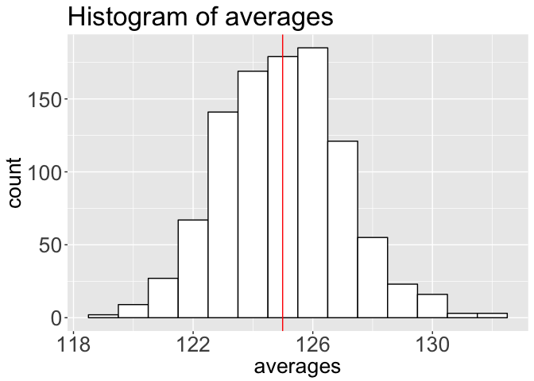
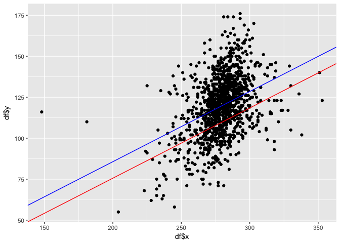
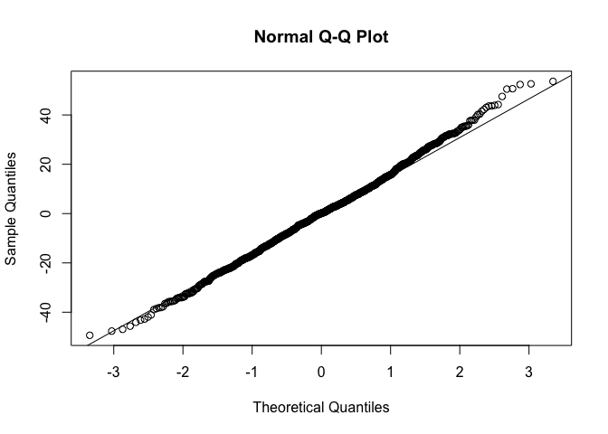

Summer 2017 Stat 135 final (take home part)
================
Karla Betel Palos Castellanos
Tuesday August 8 2017

Rules
=====

-   This is not a collaborative exam. You may not speak with another student in the class about this exam before Wednesday morning after 10am.
-   You may use any course material for this exam. You may use online resources like stack overflow.
-   Turn in your exam to b-courses by 8am on Wednesday. Please submit both an html document and your source .Rmd file. *I have included the source code used to make this document. You may edit it and use it as a template for your exam. *If you get stuck, you may email me for help. No postings on Piazza obviously. \*This exam is worth 20% of your final exam score (roughly 5% for each question).

On this exam you will explore the data set KaiserBabies.rda which contains the data frame *infants* containing information that Kaiser collects of all patients in their maternity ward at Kaiser hospital in SF during the month of May 2017.

``` r
#the function load, loads a dataset into your workspace. It outputs a vector of all dataframes in the data set. In this case there is just one data set called infants. 
data <- load(url("http://www.stat.berkeley.edu/users/nolan/data/KaiserBabies.rda"))
data
```

    ## [1] "infants"

``` r
#you can see the variables in this data frame using the head command.
head(infants)
```

    ##   gestation bwt parity age          ed ht  wt dage              ded dht
    ## 1       284 120      1  27     College 62 100   31          College  65
    ## 2       282 113      2  33     College 64 135   38          College  70
    ## 3       279 128      1  28 High School 64 115   32 Some High School  NA
    ## 4        NA 123      2  36     College 69 190   43     Some College  68
    ## 5       282 108      1  23     College 67 125   24          College  NA
    ## 6       286 136      4  25 High School 62  93   28      High School  64
    ##   dwt marital            inc          smoke number
    ## 1 110 Married   [2500, 5000)          Never  Never
    ## 2 148 Married   [7000, 8000)          Never  Never
    ## 3  NA Married   [5000, 6000)            Now    1-4
    ## 4 197 Married [12500, 15000)  Once, Not Now  20-29
    ## 5  NA Married   [2500, 5000)            Now  20-29
    ## 6 130 Married   [7000, 8000) Until Pregnant    5-9

Question 1
==========

Take a simple random sample (without replacement) of size 100 observations using the two lines of code below. The function set.seed makes it so that everyone will be using the same sample.

``` r
set.seed(7)
mysample=sample(na.omit(infants$wt),100)
```

### a)

Use the sample average to estimate the average weight of the mothers, calculate the estimated standard error of these estimates and form a 95% confidence interval for the average of the population (assuming normality works)

``` r
sample_avg_seed<- mean(mysample)
sd_sample_seed <- sd(mysample) 
n<- 100
SE<- sd_sample_seed/sqrt(n)
SE
```

    ## [1] 2.059253

``` r
lower_bound <-sample_avg_seed - (qnorm(.975))*SE
upper_bound <-sample_avg_seed + (qnorm(.975))*SE
CI<- c(lower_bound, upper_bound)
CI
```

    ## [1] 125.7439 133.8161

### b)

Repeat 1000 times (without using the set.seed function) to get 1000 different confidence intervals. How many of them do you expect to cover the true average? How many do? Note that in practice you would be unable to do this since you only get one sample.

``` r
library(dplyr)
```

    ## 
    ## Attaching package: 'dplyr'

    ## The following objects are masked from 'package:stats':
    ## 
    ##     filter, lag

    ## The following objects are masked from 'package:base':
    ## 
    ##     intersect, setdiff, setequal, union

``` r
pop<- na.omit(infants$wt)
num_samples <- 1000
sample_size <- 100
my_sample <- sample(pop,sample_size)

findE<- function(){
  resample <- sample(na.omit(infants$wt),100)
  sample_avg <- mean(resample)
  SE<-sd(resample)/10
  An<- c(sample_avg, SE)
}

S <-  replicate(num_samples, findE())
lbound<- S[1,] - (qnorm(.975))*S[2,]
ubound<- S[1,] + (qnorm(.975))*S[2,]

my_data <- data.frame(lbound,ubound)

trueAvg<- mean(na.omit(infants$wt))

TFAvgInCI<- (my_data[,2] > trueAvg & my_data[,1] < trueAvg )%>%summary(tot=sum(n))

#A
print(paste("We expect the true average to appear 950 times"))
```

    ## [1] "We expect the true average to appear 950 times"

``` r
#B
print(paste("The true average appears", TFAvgInCI[3], "times"))
```

    ## [1] "The true average appears 961 times"

### c)

Calculate the SD of the sample averages. Is it close to the estimated standard error from a)? Make a histogram of the sample averages to see if it seems plausible that the probability histogram for the sample average follows the normal curve pretty closely. Make a probability plot to further investigate. Does it seem like the confidence interval is valid?

``` r
#using fuction from last problem 
S <-  replicate(num_samples, findE())
means<- S[1,]
sampleSD <- sd(means)
sampleSD
```

    ## [1] 2.095977

``` r
hist(means)
```


``` r
qqnorm(means)
```


``` r
#The SD of the sample averages is 2.288204, and we found the SE from a) to be 2.059253, which is very similar. 


#plot1, the histogram, is a skewed but maintains an overall normal shape
#plot2, the qqnorm, looks like a straight line, which contributes to the evidence that it follows a normal distribution. A bit off at the ends but overall a straight line. 
#seems to follow normality, so the CI appear valid 
```

Question 2
==========

Starting with your original sample do the following.

### a)

Use the nonparametric bootstrap to get 1000 random samples of size 100. For each, get the sample average and make a histogram of these sample averages (this is called the sampling distribution of the mean). Put a vertical line through the average of the sampling distribution. Calculate the SD of the sample averages. Is it close to the estimated SE from 1a above?

``` r
library(ggplot2)
sample_size <- 100
num_samples<-1000
pop <- na.omit(infants$wt)
my_sample <- sample(pop,sample_size)

find_mean <- function(){
  resample <- my_sample %>% sample(replace=TRUE)
  mean(resample)
}

means_vec <-  replicate(num_samples, find_mean())
means_df<- data.frame(means_vec)


average_sample_distribution<- mean(means_vec)
average_sample_distribution
```

    ## [1] 124.9917

``` r
sd<- sd(means_vec)
sd
```

    ## [1] 2.027449

``` r
plot<- means_df%>% ggplot(aes(x=means_vec)) + 
  geom_histogram(binwidth =1,col="black",fill="white") + 
  labs(title="Histogram of averages",x="averages",y="count") + theme(
    axis.text = element_text(size = 20),
    plot.title = element_text(size = 25),
    axis.title=element_text(size=20)) +geom_vline(xintercept= average_sample_distribution, color= "red")

plot
```



``` r
print(paste("SE from part a) is 2.059253 and the sd for this problem is", sd, ". They appear to be very close."))
```

    ## [1] "SE from part a) is 2.059253 and the sd for this problem is 2.02744878753721 . They appear to be very close."

### b)

Construct a 95% bootstrap CI by taking 2.5 and 97.5 percentile of the bootstrap averages. How does it compare to the CI you got in 1a)?

``` r
bootstrapCI <- 2*average_sample_distribution-quantile(means_vec, c(.975,.025))
bootstrapCI
```

    ##    97.5%     2.5% 
    ## 120.7707 128.8037

``` r
#the bootstrap CI is (126.6777,134.4199), while the CI from part a (125.7439, 133.8161). They seem pretty close. 
```

Question 3
==========

We will now use the 1236 observations in the data set `infants` to perform a linear regression analysis.

### a)

Fit a linear relationship between the gestation period (x=`gestation`) of a baby and the baby's birthweight (y=`bwt`). What is the equation of the regression line? Make a plot of the regression line on top of the scatter diagram.

``` r
x <- infants$gestation
y<- infants$bwt
df <- data.frame(x,y)
df<-na.omit(df)

### ORIGINAL MODEL ###
OriginalModel<- lm(df$y~df$x)
summary(OriginalModel)
```

    ## 
    ## Call:
    ## lm(formula = df$y ~ df$x)
    ## 
    ## Residuals:
    ##     Min      1Q  Median      3Q     Max 
    ## -49.394 -11.125   0.071  10.106  57.353 
    ## 
    ## Coefficients:
    ##              Estimate Std. Error t value Pr(>|t|)    
    ## (Intercept) -10.06418    8.32220  -1.209    0.227    
    ## df$x          0.46426    0.02974  15.609   <2e-16 ***
    ## ---
    ## Signif. codes:  0 '***' 0.001 '**' 0.01 '*' 0.05 '.' 0.1 ' ' 1
    ## 
    ## Residual standard error: 16.66 on 1221 degrees of freedom
    ## Multiple R-squared:  0.1663, Adjusted R-squared:  0.1657 
    ## F-statistic: 243.6 on 1 and 1221 DF,  p-value: < 2.2e-16

``` r
OriginalModel$coefficients
```

    ## (Intercept)        df$x 
    ## -10.0641842   0.4642626

``` r
OModelPlot<- df %>% ggplot(aes(x=df$x,y=df$y)) + geom_point() + geom_abline(intercept=-10.0641842 ,slope = 0.4283521, color="red")
OModelPlot
```


``` r
# from the summary we can see that the x is insignificant(by analyzing the pvalue of x and in the intercept), so we can improve our model by getting rid of the intercept

### NEW MODEL ###
NewModel <- lm(df$y~df$x-1)
summary(NewModel)
```

    ## 
    ## Call:
    ## lm(formula = df$y ~ df$x - 1)
    ## 
    ## Residuals:
    ##     Min      1Q  Median      3Q     Max 
    ## -49.367 -11.081   0.064  10.066  53.633 
    ## 
    ## Coefficients:
    ##      Estimate Std. Error t value Pr(>|t|)    
    ## df$x 0.428352   0.001703   251.5   <2e-16 ***
    ## ---
    ## Signif. codes:  0 '***' 0.001 '**' 0.01 '*' 0.05 '.' 0.1 ' ' 1
    ## 
    ## Residual standard error: 16.67 on 1222 degrees of freedom
    ## Multiple R-squared:  0.981,  Adjusted R-squared:  0.981 
    ## F-statistic: 6.323e+04 on 1 and 1222 DF,  p-value: < 2.2e-16

``` r
NewModel$coefficients
```

    ##      df$x 
    ## 0.4283521

``` r
#equation of the regression line is y= 0.4283521x

NewMP<- OModelPlot + geom_abline(intercept=0,slope = 0.4283521, color="blue")
NewMP
```



### b)

Examine the residuals and comment whether the assumptions of the standard statistical model are satisfied.

``` r
x <- infants$gestation
y<- infants$bwt
df <- data.frame(x,y)
df<-na.omit(df)


NewModel.lm.resid<- residuals(NewModel)
qqnorm(NewModel.lm.resid)
qqline(NewModel.lm.resid)
```



``` r
resplot<- plot(df$x, NewModel.lm.resid) +abline(h=0, col="red")
```


``` r
resplot
```

    ## integer(0)

``` r
#from the residual plot we can confirm what we know from the residuals, that their expected value is equal to 0. This evident as we  see that the points are evenly distributed above and and below the y=0 line, which means that they do not follow any particular pattern(as it should be )

#the residual plot in combination with the qqplot (near a straight line) allows to see that the points follow a normal distribution, which are part of the assumptions required for the standard statistics model. 
```

### c)

Assuming the model is reasonable, what birthweight would you predict to have if a baby has a gestation period of 300 days?

``` r
y= 0.4283521*(300)
y
```

    ## [1] 128.5056

``` r
# from our new model( the one that excludes the intercept) we can predict to have a baby that wights 128 at birth.
```

Question 4
==========

We wish to compare the mean gestation birth weight (`bwt`) of mothers who smoke (`smoke=Now`) versus mothers who don't smoke (`smoke=Never`). I will help you with data cleaning and then I want you to do a statistical analysis of whether birthweights are significantly different if mothers smoke or not.

Lets create a smaller data frame from `infants` consisting of two variables `gestation` and `smoke`. We will eliminate observations if the `smoke` doesn't take the value `smoke=Never` or `smoke=Now`.

``` r
library(dplyr)
smoke <- infants$smoke
gestation <- infants$gestation
df <- data.frame(smoke, gestation)
df <- df %>% filter(smoke=="Never" |  smoke =="Now") #make data frame where smoke variable takes only two values, "Never" or "Now"
```

    ## Warning: package 'bindrcpp' was built under R version 3.4.4

``` r
head(df)
```

    ##   smoke gestation
    ## 1 Never       284
    ## 2 Never       282
    ## 3   Now       279
    ## 4   Now       282
    ## 5 Never       244
    ## 6 Never       245

The data frame `df` is in tidy format (see lecture 14 in class exercises).

### a)

Make a boxplot to examine `gestation` as a function of `smoke`. What do you conclude?

``` r
smoke <- infants$smoke
gestation <- infants$gestation
df <- data.frame(smoke, gestation)
df <- df %>% filter(smoke=="Never" |  smoke =="Now") #make data frame where smoke variable takes only two values, "Never" or "Now"
head(df) 
```

    ##   smoke gestation
    ## 1 Never       284
    ## 2 Never       282
    ## 3   Now       279
    ## 4   Now       282
    ## 5 Never       244
    ## 6 Never       245

``` r
boxplot(formula=df$gestation~df$smoke)
```


``` r
#the group people who have never smokes appears to have more outliers. Also they appear to have a slightly longer gestation period.The avgs appear to be about the same for both, and they both seem to follow a normal distribution 
```

### b)

Make a check of the assumption that the distributions of `gestation` are normal by making a Normal Q-Q plot. Also make a plot to check that the variances are the same. What are your conclusions?

``` r
SGestation <- df %>% filter(smoke=="Now")
NSGestation <- df %>% filter(smoke=="Never")
SGestation <- SGestation$gestation
NSGestation <- NSGestation$gestation
A<-qqnorm(SGestation, col= "red")
```


``` r
B<-qqnorm(NSGestation, col= "blue")
```


``` r
qqplot(SGestation,NSGestation)
```


``` r
# from the line in the qqplogt (although seemingly straight) we can conclude that the variance are not the same (by looking at the ends)
```

### c)

Make a t-test and a nonparametric Mann-Whitney test to test the null hypothesis that the mean gestation periods are the same. Which result to you have more confidence in?

``` r
#Ho: mean difference in gestation period for smokes and non smokers is the same (=0)
#Ha:  mean difference in gestation period for smokes and non smokers is the same (=!0)

# we reject the Ho for small pvlaue 

t.test(SGestation,NSGestation,alternative="two.sided",mu=0,var.equal=FALSE,conf.level = 0.95)
```

    ## 
    ##  Welch Two Sample t-test
    ## 
    ## data:  SGestation and NSGestation
    ## t = -1.6688, df = 1015.7, p-value = 0.09546
    ## alternative hypothesis: true difference in means is not equal to 0
    ## 95 percent confidence interval:
    ##  -3.6043579  0.2913157
    ## sample estimates:
    ## mean of x mean of y 
    ##  277.9792  279.6357

``` r
wilcox.test(SGestation,NSGestation,alternative="two.sided",mu=0,conf.level=0.95)
```

    ## 
    ##  Wilcoxon rank sum test with continuity correction
    ## 
    ## data:  SGestation and NSGestation
    ## W = 117550, p-value = 0.01349
    ## alternative hypothesis: true location shift is not equal to 0

``` r
#From the wilcoxon text the pvalue is smaller than 0.05, which confirm our idea that there is a difference to the gestation period between smokes and nonsmokers. This also can give us clues to answer the question before about variance, by showing that there is a significant difference in the two groups. We fail to reject under the two sided two sample t test. ( on this test we assumed var were not equal from our previous question). The Mann Whitney test appear to be more favorable and useful for us as we did not have to make any assumptions about our distributions (i.e. normality, variability,etc.) I felt more confident in the results the Mann-Whitnet test yields. 
```
