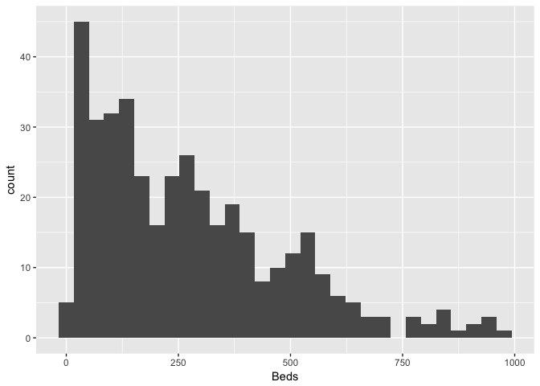
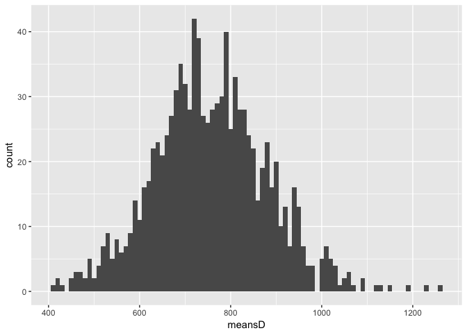
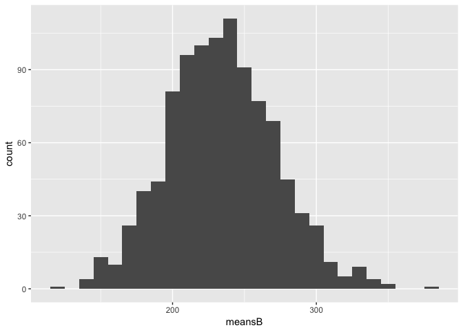

Lab2
================
Karla Palos

``` r
#a)
library(dplyr)
```

    ## 
    ## Attaching package: 'dplyr'

    ## The following objects are masked from 'package:stats':
    ## 
    ##     filter, lag

    ## The following objects are masked from 'package:base':
    ## 
    ##     intersect, setdiff, setequal, union

``` r
library(ggplot2)
library(readxl)
hospitals <- read_excel("~/Desktop/hospitals.xls")

data <- as.matrix(hospitals)
data1<- data.frame(hospitals)

ggplot(data1, aes(x=data1$X.discharges)) + geom_histogram() +xlab("Discharges")
```

    ## `stat_bin()` using `bins = 30`. Pick better value with `binwidth`.


``` r
ggplot(data1, aes(data1$X.beds.)) + geom_histogram() +xlab("Beds")
```

    ## `stat_bin()` using `bins = 30`. Pick better value with `binwidth`.



``` r
#b)

colMeans(data)
```

    ## 'discharges'       'beds' 
    ##     814.6031     274.8244

``` r
var(data)
```

    ##              'discharges'    'beds'
    ## 'discharges'     347766.4 114565.71
    ## 'beds'           114565.7  45484.23

``` r
sd(data[,1])
```

    ## [1] 589.7173

``` r
sd(data[,2])
```

    ## [1] 213.2703

``` r
#c)

#STEP 1
# take one sampke from discharges and one from beds size n=25 and assign them to my_n25_sample_D and my_n25_sample_B resprectively
sample_size <-25
number_of_samples <- 1000 

#Discharges:
discharges_pop <- data1$X.discharges
my_n25_sample_D <-discharges_pop%>%sample(sample_size)
#Beds:
beds_pop<- data1$X.beds
my_n25_sample_B <-beds_pop%>%sample(sample_size)


#STEP 2
# we are taking 25 samples from the above sample with replacement and fiding the meansa of the resampling 

#Discharges:
find_meanD <- function(){
resample <-  my_n25_sample_D%>% sample(replace=TRUE)
mean(resample)
}
#Beds:
find_meanB <- function(){
resample <-  my_n25_sample_B%>% sample(replace=TRUE)
mean(resample)
}


#STEP 3 
#we create  a vectors of means (for each of the two variables), containg the mean of 1000 samples size n=25 

#Discharges:
meansD<- replicate(number_of_samples, find_meanD())
#Beds:
meansB<- replicate(number_of_samples, find_meanB())

#SE and VAR

#Discharges 
sd(meansD)
```

    ## [1] 124.7313

``` r
var(meansD)
```

    ## [1] 15557.9

``` r
#Beds
sd(meansB)
```

    ## [1] 37.47367

``` r
var(meansB)
```

    ## [1] 1404.276

``` r
#STEP 4
#Historgrams 

#Discharges 
my_dataD <- data.frame(meansD)
#Beds
my_dataB <- data.frame(meansB)

#STEP5
#histograms

#Discharges
my_dataD %>% ggplot(aes(x=meansD)) + geom_histogram(binwidth=10)
```



``` r
#Beds
my_dataB %>% ggplot(aes(x=meansB)) + geom_histogram(binwidth=10)
```



``` r
#d)

my_sampleD <- sample(discharges_pop,sample_size);
mean(my_sampleD)
```

    ## [1] 725.16

``` r
my_sampleB <- sample(beds_pop,sample_size);
mean(my_sampleB)
```

    ## [1] 300.88

``` r
#e)

#Estimate sigma_hat
#Do not forget to add pop correction factor ( n=25 and N=393)

#Discharges
sigma_hatD<- sqrt( var(my_sampleD)*(1-25/393)) 
#Beds
sigma_hatB<- sqrt( var(my_sampleB)*(1-25/393)) 


#CONFIDENCE INTERVALS

#f)

#Discharges
mean(data[,1])
```

    ## [1] 814.6031

``` r
CI_lower_D = mean(my_sampleD) - 1.96*(sigma_hatD)*(1/5)
CI_upper_D = mean(my_sampleD) + 1.96*(sigma_hatD)*(1/5)

CI_lower_D
```

    ## [1] 543.9844

``` r
CI_upper_D
```

    ## [1] 906.3356

``` r
#Beds
mean(data[,2])
```

    ## [1] 274.8244

``` r
CI_lower_B = mean(my_sampleB) - 1.96*(sigma_hatB)*(1/5)
CI_upper_B = mean(my_sampleB) + 1.96*(sigma_hatB)*(1/5)

CI_lower_B
```

    ## [1] 213.1835

``` r
CI_upper_B
```

    ## [1] 388.5765

``` r
#g)


sample_size = 100
#N<-393

#Discharges
my_sample_D <- sample(discharges_pop,sample_size)
mean(my_sample_D)
```

    ## [1] 798.12

``` r
sigma_hat_D<- sqrt(var(my_sample_D)*(1- 100/393) )


mean(data[,1])
```

    ## [1] 814.6031

``` r
CI_l_D = mean(my_sample_D) - 1.96*(sigma_hat_D)*(1/10)
CI_u_D = mean(my_sample_D) + 1.96*(sigma_hat_D)*(1/10)

CI_l_D
```

    ## [1] 708.1165

``` r
CI_u_D
```

    ## [1] 888.1235

``` r
#Beds
my_sample_B <- sample(beds_pop,sample_size)
mean(my_sample_B)
```

    ## [1] 279.02

``` r
sigma_hat_B<- sqrt(var(my_sample_B)*(1- 100/393) )


mean(data[,2])
```

    ## [1] 274.8244

``` r
CI_l_B = mean(my_sample_B) - 1.96*(sigma_hat_B)*(1/10)
CI_u_B = mean(my_sample_B) + 1.96*(sigma_hat_B)*(1/10)

CI_l_B
```

    ## [1] 241.2465

``` r
CI_u_B
```

    ## [1] 316.7935
